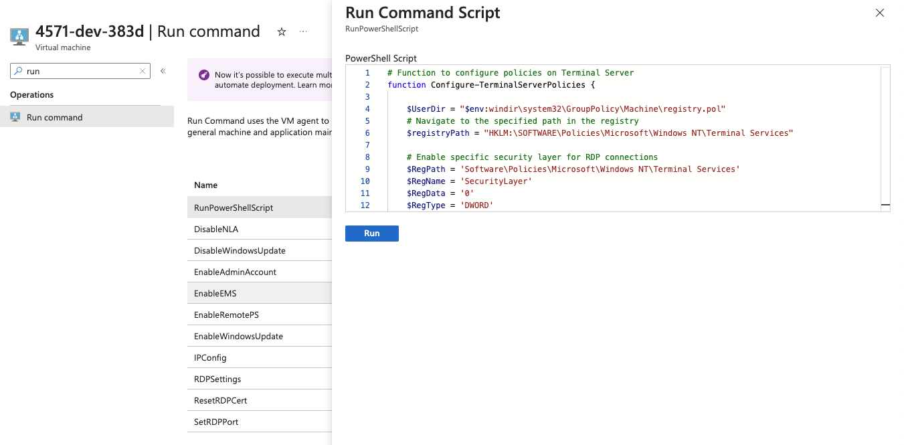

# Usage

Azure Windows VM doesn't run `custom_data`, it is different to AWS `user_data`

Reference: https://learn.microsoft.com/en-us/azure/virtual-machines/custom-data#windows

>Windows
>Custom data is placed in %SYSTEMDRIVE%\AzureData\CustomData.bin as a binary file, **but it isn't processed**. If you want to process this file, you need to build a custom image and write code to process CustomData.bin.

So we have to run command on the vm after it is created. 

copy the content in file [templates/azure-user-data.ps1](templates/azure-user-data.ps1) and run it with run command `RunPowerShellScript`

